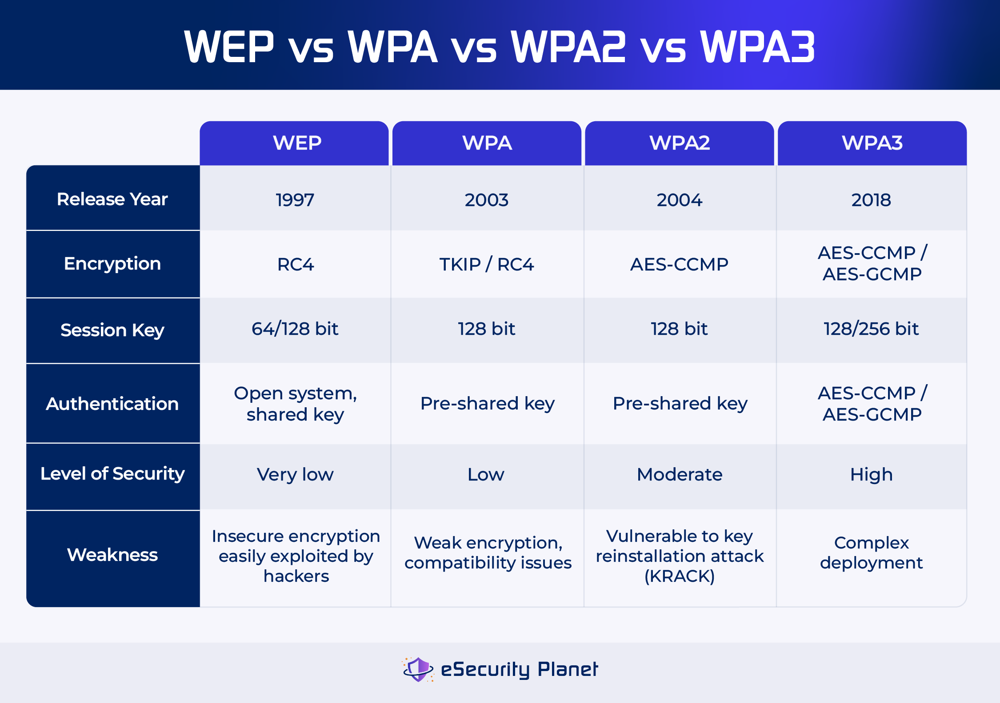

# Wi-Fi Bunny

A tool to easily set up a evil twin attack system on vulnerable Wi-Fi networks.

Read the proposal: [proposal](./docs/proposal.txt)
Find some references here: [references](./docs/references.txt)

## Setup

## Theory

Wi-Fi works on these wireless security protocols, WPA, WPA2, WPA3 and WEP. The differences in between them is listed in this table below

